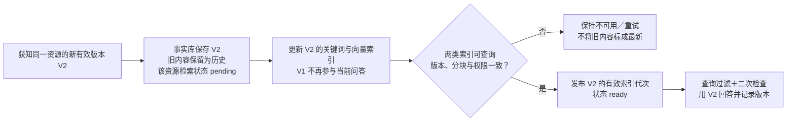

# 索引与新鲜度：设计草案

- 日期：2026-10-05
- 状态：Proposed，供方案讨论，尚未实现。
- 已确认边界：集成版采用 Qdrant，保障系统内撤权；原平台权限同步只预留接口。
- 关联需求：REQ-004、REQ-015、REQ-017；索引授权与撤权沿用 REQ-002 / REQ-005。

## 1. 原文、向量、索引不是同一件事

结构化事实库保存文档实际内容和可信状态；文本向量是由 Embedding 模型生成的语义表示；索引是帮助快速查找的派生结构。

| 索引 | 查找依据 | 举例 | 目标存放位置 |
|---|---|---|---|
| 结构化字段索引 | ID、租户、来源、项目、版本、状态等字段 | 找某项目当前有效的文档 | SQL 字段索引；Qdrant 对检索副本的 payload 索引 |
| 关键词索引 | 词语与包含它的文档 / 分块之间的关联 | 精确查错误码或 Jira 编号 | 改造后的 SQLite FTS5 |
| 向量索引 | 文本向量的近邻关系 | 用不同问法查找语义相近内容 | Qdrant 管理的向量检索结构 |

Qdrant 的 point 保存向量、标识和 payload 元数据；向量索引用于相似度检索，payload 索引用于加速过滤。数据库能存一个字段，不代表已经为它建立索引；只有实际参与过滤的字段才按类型建立相应索引。

Qdrant 的 point ID 使用其支持的整数或 UUID；应用可用稳定 UUID 编码租户、资源、版本与分块身份，不把任意拼接字符串当作合法 point ID。

## 2. 文档进入索引的过程

1. 原始内容保存在 Raw Store。
2. 转为统一文档记录，确定稳定资源 ID、内容版本、来源、项目和基础 ACL。
3. 按内容结构切成分块，每个分块继承所属文档版本与权限边界。
4. 关键词索引记录词与分块的关联。
5. Embedding 模型生成每个分块的向量；Qdrant 保存向量和过滤元数据，并维护检索结构。
6. 应用验证这批内容可查询且与事实库一致，再发布到当前检索视图。

文本内容未变化且 Embedding 模型及处理配置一致时，可以复用缓存向量。权限或项目标签变化一般更新元数据，不重新计算语义向量。内容、分块方式或模型版本变化时，更新受影响的派生内容，而不是机械重建全部数据。

本轮不声称 Qdrant 安装后会自动解决账号映射、权限合成、新鲜度和索引一致性。这些仍由应用工程完成。

## 3. 新鲜度分成三个问题

1. 内容版本一致性：检索证据是否对应系统当前指定的有效文档版本？
2. 来源检查时效：多久以前确认过来源状态，是否可能存在尚未知晓的变化？
3. 业务有效性：内容是否已生效、被撤回、被新结论替代，或者属于有效历史？

第一项可用版本、哈希与索引完成状态确定性检查。第二项依赖来源同步 / 检查，离线数据只能说明相对快照一致，不能证明与真实平台此刻一致。第三项部分依赖正式状态与有效时间，跨来源业务冲突还属于 REQ-011，不能只按修改时间判断。

## 4. 建议字段与用途

以下是设计字段，不是已存在的完整数据模型；具体 schema 和门槛还需实施前确认。

| 字段 | 用途 |
|---|---|
| resource_id | 稳定标识同一个来源对象，不仅凭标题判断同一文档 |
| revision_id | 标识一次来源快照 / 内容版本；优先保留来源原生版本，缺失时由系统生成 |
| content_hash | 检查标准化文本内容是否相同；哈希不能证明事实正确或来源时序 |
| latest_known_revision | 系统最近获知的来源版本，不宣称一定是真实平台最新版本 |
| effective_revision | 当前业务视图指定的有效版本；回滚时可以指定旧内容版本 |
| indexed_revision | 某条索引证据实际对应的内容版本 |
| source_updated_at | 来源报告的修改时间；缺失时保持未知 |
| observed_at | 内容被系统采集 / 导入的时间 |
| indexed_at | 对应版本完成索引发布的时间 |
| last_content_check_at | 最近成功检查内容来源的时间；与 ACL 检查分开 |
| valid_from / valid_until | 可选的业务生效范围，不默认等同于修改时间 |
| status | active、withdrawn、deleted 等显式状态 |
| index_generation / index_state | 索引发布代次与 pending / ready / failed 状态 |
| pipeline_fingerprint | 分块、Embedding 模型和处理配置的版本标识 |
| acl_revision / permission_epoch | 文档权限与身份权限状态的独立版本，不与内容版本混用 |

若输入只有离线导出时间而没有来源修改时间，不使用导入时间冒充来源修改时间。来源内容检查与来源 ACL 检查是两个接口，本轮外部 ACL 接口默认未启用，不代表来源内容永远不需要同步。

## 5. 判断逻辑

当前查询模式下，证据可用需要满足：

```text
当前用户有权限
AND 文档处于当前有效状态及生效范围
AND indexed_revision == effective_revision
AND 对应索引代次已完成发布
AND 内容校验和处理配置符合预期
```

Qdrant 不能自动跨库读取 SQL 的有效版本指针。应用负责把可信有效状态同步到检索元数据，生成过滤条件，并在召回后回到事实库再次核对版本和权限。

| 情况 | 状态表达与行为 |
|---|---|
| 有效版本 V2，索引仍为 V1 | stale / pending；当前问答排除 V1，等待 V2 完成 |
| 版本与配置一致、索引 ready | current relative to known snapshot；注明检查 / 快照时间 |
| 已知来源检查失败或长时间未检查 | unknown / unchecked；按业务风险选择警告或拒答，不断言已过期或已最新 |
| 版本已同步但完成耗时超出目标窗口 | delayed；这表达同步性能，不自动表示内容仍为旧版 |
| 已删除、撤回或当前用户被撤权 | 当前问答不可用；不依赖更新时间是否较新 |
| 明确历史查询或回滚 | 使用指定有效内容版本，但仍按现在的真实身份权限鉴权 |

文档发布很久并不自动过期：一年前仍有效的正式政策可以 current，昨天修改的草稿也不自动比它更权威。TTL 可以触发重新检查，不能单独证明事实已经失效。

## 6. 一次安全更新

示例：同一份“支付限额说明”从 V1 的 5 万改成 V2 的 10 万，V2 已生效。



SQL 与 Qdrant 之间没有自动共享事务，不能只翻一个 is_current 布尔值就声称安全切换。建议由应用维护发布门闩、待更新资源阻断集合与版本代次：新内容在准备区，只有两类索引确认就绪才发布；准备 / 失败期间在检索条件中排除受影响资源，结果与回答交付前再核验事实库。

迟到的 V1 任务不得覆盖已生效的 V2，更新发布使用单调代次或等效并发校验。具体一致性协议、阻断集合规模和故障恢复需要实现与测试，不是 Mermaid 图本身提供的保证。

回滚时保留 V2，显式选择 V1 的内容并发布一个新的控制代次；不能把时间戳改旧或删除历史来伪造回滚。V1 的缓存向量若仍匹配模型和分块配置可以复用，但当前权限必须重新检查。

## 7. 与本轮权限范围的关系

系统内用户组变化：更新身份权限库 / permission_epoch；下一次检索生成新过滤条件，旧缓存失效，不必为所有文档重新做 Embedding。

系统内文档撤权：先持久化拒绝与阻断状态，再更新相关 chunk 的权限元数据；尚未同步到 Qdrant 的内容也不得继续通过旧权限被检索或交付。

原平台 ACL 同步：本轮预留接口，只返回明确的未启用 / 未知状态，不能假装已经检查。导入 ACL 快照与本地限制仍同时应用。本轮范围不取消后续的来源 ACL 保真需求。

## 8. 建议验收样例

- V1 更新 V2 后，当前回答不再使用 V1。
- 只完成关键词或只完成向量更新时，相关资源不提前恢复可用。
- 索引失败、迟到任务和重试不会把旧版本重新发布为当前。
- 只改本地权限时，无需重做 Embedding；下一次查询与原文读取立即遵守新权限。
- 离线快照明确显示来源检查未知，不宣称实时最新。
- 回滚与历史查询仍以当前用户权限鉴权。
- 正式旧文、未来生效版本、撤回文档、来源时间缺失分别得到正确处理。

参考官方能力：[Qdrant 索引](https://qdrant.tech/documentation/manage-data/indexing/)、[查询过滤](https://qdrant.tech/documentation/search/filtering/)、[Points 与更新操作](https://qdrant.tech/documentation/manage-data/points/)。上述版本和发布协议是本项目提出的应用层设计，不是 Qdrant 自动提供的跨库一致性保证。
