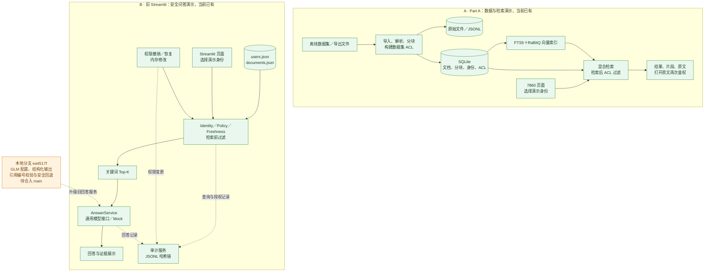
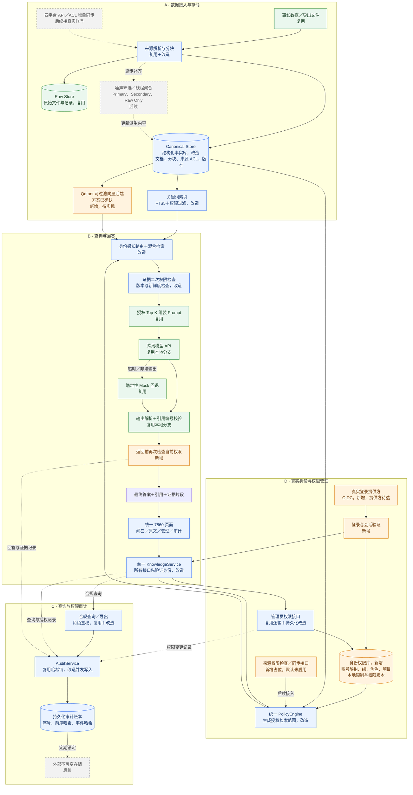

# ContextLedger：现状与集成架构方案

- 日期：2026-10-05
- 状态：方案已保存，部分关键设计已确认，未开始实现。
- GitHub main 核对版本：`1359a7dacb54b3e0eb33f281ffd43eeb51aace06`。
- 本地模型集成基础版本：`ea4517f`，原分支 `feat/REQ-009-tokenhub-integration`。
- 本文是项目仓库内的方案记录，不在 Obsidian 维护第二份项目状态。

## 1. 已确认与待确认

| 事项 | 决定 | 状态 |
|---|---|---|
| 集成入口 | 保留 Part A 7860 页面，迁入旧 Streamlit 的服务能力 | 已确认，待实现 |
| 身份权限 | 增加持久化身份权限库 | 已确认，待实现 |
| 真实登录 | 使用 OIDC | 方向已确认，提供方待选 |
| 结构化存储 | 原文、权限和版本仍需结构化保存，向量索引不取代它们 | 已确认 |
| 离线 ACL | 后续讨论如何与身份权限库保持一致 | 待设计，暂不改动 |
| 索引权限 | 沿用 REQ-002，使用 Qdrant 元数据过滤并保留服务端二次检查 | 方向已确认，实现待设计 |
| Qdrant | 集成版采用可过滤的 Qdrant 向量后端 | 已确认，尚未安装或迁移 |
| 系统内撤权 | 本轮保障持久化权限变更、索引与缓存过滤、下一次请求及交付前检查 | 本轮范围 |
| 原平台撤权 | 暂不实现自动发现与同步，只预留检查 / 同步接口并明确未启用状态 | 后续接入 |
| 摄取审计 | 不重新加入先前取消的四个摄取审计模块 | 不在本轮范围 |

相关已接受决策见 [ADR-0002](../decisions/ADR-0002-unified-entry-and-trusted-identity.md)。用户本次仍要求先解释、先确认，不开始修改业务代码。

## 2. 两部分目前分别实现了什么

| 功能 | 旧 Streamlit / src | Part A / contextledger |
|---|---|---|
| 数据进入系统 | 手写 JSON 演示数据 | 离线数据集和导出文件导入 |
| 数据保存 | JSON 和内存 | 原始文件 / JSONL、SQLite 标准化数据 |
| 来源处理 | 已预先整理的文档 | 来源解析、基础清理、分块与部分文件解析 |
| 检索 | 关键词匹配 | FTS5、RaBitQ 向量、融合排序 |
| 权限 | 部门、角色、项目、密级；检索前检查 | 数据集身份与 ACL；检索后过滤，打开原文再次检查 |
| 权限管理 | 项目权限撤销和恢复，修改进程内存 | 尚无管理界面和持久化管理流程 |
| 时间与新鲜度 | 来源更新、同步与 stale 过滤的模拟闭环 | 部分数据集的 as-of 日和入离职时间；没有完整实时新鲜度机制 |
| 回答 | 通用大模型接口与 Mock；强化校验在本地分支 | 检索结果展示，未接旧回答服务 |
| 审计 | 查询、权限变化、合规查询及本地哈希链 | 未接旧审计服务 |
| 真实登录 | 无，选择演示身份 | 无，选择演示身份 |

Slack 的基础清理与分块不等于已实现垃圾筛选、决策提取、增量摘要或 Primary / Secondary / Raw Only。数据集推断 ACL 也不等于真实平台的实时鉴权。

### 当前架构：两条独立运行链路

绿色表示已有；橙色表示本地已有但待合入 main。两套业务链路没有连通箭头，因为目前没有集成。

## 3. 集成目标架构

整个图是目标方案，不代表这些连接已实现。绿色“复用”、蓝色“改造”、橙色“新增”、灰色“后续”。所有节点同时用文字标注状态，不只依靠颜色。

用户已确认采用 Qdrant；这表示选型确认，不代表已经安装或迁移。关键词与向量索引必须采用一致的可信权限边界。原平台权限同步只预留接口，本轮不实施自动撤权同步。

读图：从 A 的数据接入开始，原始内容与标准化内容分别保存，再生成索引。B 接收问题，D 提供可信身份和授权范围，授权证据才进入模型。模型返回后校验引用和当前权限；C 保存查询、回答和权限变更的审计。审计写入的成功应成为答案交付条件，具体事务、并发与失败处理在实现前设计。

本轮不增加四个摄取审计模块。原始内容、来源链接和筛选原因属于可追溯性，不自动提升为完整摄取审计系统。

## 4. 关键设计说明

### 存储分工

- Raw Store：保存导入的原始记录与文件，便于追溯和恢复。
- Canonical Store：保存统一格式的文档、分块、来源 ACL、版本与有效状态。
- 身份权限库：保存真实账号与来源身份映射、组织、组、本地规则和权限版本。
- 检索索引：用于查找的派生副本，可从事实与权限数据重建；不是唯一事实源。
- 审计账本：持久保存查询与权限行为，访问受到独立约束。

当前 Part A `build` 会重建输出目录。身份权限与审计数据不得放进会被重建清空的目录；后续必须隔离重建边界或改为安全的代际索引发布。

### 登录与来源权限

OIDC 证明“你是谁”，不能自动赋予四个平台全部内容的权限。系统通过稳定身份标识把登录账号映射到系统用户和来源身份，不凭姓名自动赋权。

来源 ACL 允许且本系统限制允许，才可读取来源内容；本地规则可以收紧，不能绕过来源限制。离线推断 ACL 的精细映射暂留待后续讨论，不能静默当成真实平台权限。

### Qdrant 与权限过滤：选型已确认，尚未实现

Qdrant 是向量数据库 / 检索服务，可按向量相似度搜索，并通过 payload 元数据条件过滤。它不会自动认识公司员工或替应用决定 ACL，仍需要服务端提供正确的身份、过滤条件与二次检查。

Part A 当前是“全库范围近邻召回，再删除无权候选”，不是逐一遍历所有文档。向量路径默认召回最多 80 个 chunk 候选，然后去重到文档、检查 ACL。

后过滤并非必然泄漏，只要未授权内容始终被限制在受控服务内部且不会进入 UI、模型或不当日志，仍可形成安全的演示。不过存在以下问题：

1. 召回损失：若前 80 个候选都无权访问，而第 81 个是相关的授权内容，后过滤会错过它；返回空不等于没有相关授权内容。
2. 工作浪费：低可见比例下要反复扩大候选并进行额外查询，实际成本需测量，不能未经测试就断言慢。
3. 边界维护：各检索、原文、缓存、模型和日志路径都必须防止绕过过滤；既有 REQ-002 还明确要求权限条件进入索引层。

已确认方向：集成版采用 Qdrant 的过滤查询。服务端生成可信过滤条件，实际过滤字段建立 payload 索引，保留对查询结果的二次权限与版本检查。不得把仅增加 Top-K 后过滤宣称为已经实现索引层授权。实现后仍需验证授权结果召回、延迟、更新与系统内撤权时效、部署成本及内存。

### 新鲜度不等于按日期过滤

Part A 对部分数据集支持 as-of 日、排除未来记录及入离职检查；文档也有内容哈希版本标识。但尚未完整实现：来源最新版本与已索引版本比较、增量同步窗口、stale 状态、删除 / 撤回、当前版本指针和历史回退。

旧 Streamlit 有来源变化、新鲜度判断和同步恢复的模拟闭环；该能力还没有接到 Part A 的数据链路。数据不完整时必须标“未知”或“离线快照”，不能编造时间证明已经同步。

索引类型、版本字段、时效与安全发布的详细设计见 [索引与新鲜度草案](index-and-freshness.md)。该草案提出的是目标实现，不是当前 Part A 已有能力。

### 本系统与原平台

- 本系统：ContextLedger，包括页面、应用服务、身份权限库、原始和标准化存储、检索与审计。
- 原平台：内容最初所在的 Confluence、Jira、Slack、Google Drive。

本系统撤权是自己数据库内的变化，可在提交后由下一次请求直接读取。原平台撤权是外部变化：ContextLedger 只有通过 Webhook、增量同步或在线校验获知后才能执行。不能在还没有真实 Connector 时承诺外部撤权即时生效。

本轮明确只保障系统内撤权。保留来源权限检查 / 同步的适配接口，定义来源、资源、权限版本、检查时间、同步游标与结果状态的边界；默认未启用时返回 not_enabled 或 unknown，不调用真实平台，也不冒充“权限未变化”或“同步成功”。导入的来源 ACL 快照继续作为基础约束，后续启用接口不得扩大原平台权限。

撤权应持久化并更新权限版本、使旧缓存失效，必要时暂停尚未同步的索引内容。模型调用前和回答交付前都检查；已经被用户读取或已经发送到外部模型的内容无法通过后续撤权收回。

### 引用校验范围

复用本地分支的合法编号 / 本次授权 Top-K 范围检查，不将其描述为逐句事实支持验证。更强的主张—证据验证是后续能力。

## 5. 需求归属与建议步骤

| 目标 | 需求归属 |
|---|---|
| 真实登录、身份权限库与可信身份边界 | REQ-016，team_decision，planned |
| 统一 7860 入口与两条链路集成 | REQ-017，team_decision，planned |
| 索引层权限与二次检查 | 扩展既有 REQ-002，不新建重复需求 |
| 来源 ACL 保真与身份映射 | REQ-003；具体离线映射后续讨论 |
| 来源版本、同步、过期与回退 | REQ-004 |
| 权限变化即时生效 | REQ-005 |
| 审计、哈希链、合规查询 | REQ-006 / 007 / 008 |
| 回答、授权上下文与引用 | REQ-001 / 009 |
| 来源筛选、分类、混合索引与路由 | REQ-014 / 015 |

建议先对齐分支与需求，再实现可信身份和持久化权限、统一数据与可过滤检索、接回答和审计，最后验证撤权、新鲜度、接口越权、重启与重建的安全闭环。真实四平台同步、信息分层、外部审计锚定按独立里程碑开展，不标成已有能力。

本轮外部权限同步延期是团队的阶段范围选择，不代表比赛官方来源权限要求已获豁免；既有官方需求与尚未完成的验收差距仍保留。

## 6. 代码与官方资料证据

以下链接固定到核对的 main 版本，避免将本地分支能力混同于远程 main：

- [旧身份撤权仅写内存](https://github.com/Panyuxiang0830/Hackson_fintech/blob/1359a7dacb54b3e0eb33f281ffd43eeb51aace06/src/identity.py#L37)
- [旧问答与审计编排](https://github.com/Panyuxiang0830/Hackson_fintech/blob/1359a7dacb54b3e0eb33f281ffd43eeb51aace06/src/service.py)
- [Part A 的 SQLite 数据与索引](https://github.com/Panyuxiang0830/Hackson_fintech/blob/1359a7dacb54b3e0eb33f281ffd43eeb51aace06/contextledger/store.py)
- [Part A 先查索引再过滤 ACL](https://github.com/Panyuxiang0830/Hackson_fintech/blob/1359a7dacb54b3e0eb33f281ffd43eeb51aace06/contextledger/search.py)
- [向量查询接口没有 ACL 参数](https://github.com/Panyuxiang0830/Hackson_fintech/blob/1359a7dacb54b3e0eb33f281ffd43eeb51aace06/contextledger/vectors.py#L162)
- [Part A 的数据集时间访问检查](https://github.com/Panyuxiang0830/Hackson_fintech/blob/1359a7dacb54b3e0eb33f281ffd43eeb51aace06/contextledger/acl.py#L311)
- [重建输出目录的边界](https://github.com/Panyuxiang0830/Hackson_fintech/blob/1359a7dacb54b3e0eb33f281ffd43eeb51aace06/contextledger/pipeline.py)
- [本地模型集成基础版本](https://github.com/Panyuxiang0830/Hackson_fintech/commit/ea4517f)
- [Qdrant 查询过滤](https://qdrant.tech/documentation/search/filtering/)
- [Qdrant 元数据与向量索引](https://qdrant.tech/documentation/manage-data/indexing/)
- [Authlib Flask OIDC 集成](https://docs.authlib.org/en/latest/oauth2/client/web/flask.html)
