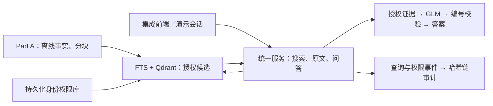

# Part A 集成版：变更对比与 PR 审查说明

日期：2026-10-07；2026-10-08 补充评测兼容修复。关联需求：REQ-017，复用 REQ-002 至 REQ-009、REQ-015、REQ-016、REQ-018、REQ-019。本文不增加功能或官方交付要求。

## 2026-10-08 合并准备

- 本轮同时集成评测分支的 `1013f419`、`9deded70` 与 PR #6 的性能改动 `b623d1df`，不是只合入旧 PR #5 的首个提交。
- 修复重新分块后旧 Qdrant 仍标记 ready 的问题；元数据主键、授权字段、分块及派生 ACL 写入进入变更计数。旧触发器升级时重新验证快照，未变化的查询仍使用常量成本检查。
- 重用向量要求模型 revision 和完整分块摘要匹配，不接受“条数相同”但内容变化的缓存。重建使用独立事实库副本及新 collection；共享旧向量目录时拒绝重新分块，避免损伤原 Part A 缓存。
- CI 同时安装集成依赖与轻量 Part A 测试依赖。全新虚拟环境安装相同清单后，161 项测试通过，需求同步检查通过；该结果不等于已完成服务器重建或完整回答质量评测。
- 用户已条件授权：真实索引重建、权限／审计验证以及 PR 检查通过后可合并。服务器连接和实际部署结果随后记录在集成实施说明；未完成时不合并 main。

下文 86 项测试、旧快照规模及不自动合并约束为前一轮交接历史，最新执行结果与用户条件授权以上述记录为准。Query Planner、实时同步、生产身份及完整质量／规模评测仍未完成；离线 BGE/Qwen 实验没有自动进入集成前端。

## 比较基线与本次范围

- 本次核对的远程 `main`：`1359a7dacb54b3e0eb33f281ffd43eeb51aace06`，其中 Part A 使用 `contextledger/demo_app.py`、`contextledger/search.py` 和本地 RaBitQ。
- 集成功能实现核对点：`0aef6ea42ced9c61ad6e2c48044605c87b25f7fe`，工作分支 `codex/REQ-017-unified-integration`；本次交接随后增加审查说明、需求影响范围及文档同步，并修正 PR 干净环境的依赖声明、添加相应回归，不增加业务功能。
- main 已有两个独立原型：Part A 的数据／检索演示，以及旧 Streamlit 的小数据安全问答。不能把旧 Streamlit 已有的审计、回答和撤权说成此次从零发明；本次重点是让它们实际接到 Part A 数据和检索上。
- 用户授权创建 PR，交由同事审查并决定合并；Agent 不执行 main 合并，不启用自动合并。需求仍为 in_progress，不把提交 PR 当作完整产品验收。

## 相比 main 的 Part A 改进

| 部分 | 原 Part A | 集成工作分支 |
|---|---|---|
| 数据基础 | 已有离线数据解析、SQLite 标准化事实、分块、FTS 和 Embedding | 继续复用，不重做导入；SQLite 事实库未被向量库替代 |
| 身份 | 页面选择来源 principal，搜索／原文参数可直接指定该身份 | 服务端会话固定系统账号，持久化来源身份绑定；演示为独立管理员与六个员工，不是生产认证 |
| 权限管理 | 来源导入 ACL 与规则，没有统一的管理员管理闭环 | 独立 IAM SQLite；管理员可停用账号、撤销绑定、修改角色／密级，管理平台／项目／部门／文档／数据集本地拒绝 |
| 检索权限 | 关键词／RaBitQ 先找候选，再在应用内按来源 ACL 过滤 | FTS SQL 和 Qdrant 查询内部执行授权过滤，返回后再核对事实、权限和版本；失败不走无过滤旁路 |
| 向量检索 | 每个数据集的本地 RaBitQ IVF | 集成路径使用可过滤 Qdrant；保留关键词、语义和混合模式，原版路径仍保留 |
| 问答 | 主要展示搜索结果和原文，没有接上统一安全问答 | 授权 Top-K 进入 GLM-5.3-Flash，返回答案与编号引用；无配置使用确定性模式，真实 API／校验失败明确拒答，不拼接片段冒充正常回答 |
| 撤权 | 缺少持久化管理员撤权与交付闭环 | 当前权限版本贯穿搜索、原文、模型调用前后和 HTTP 交付；生成中发生撤权丢弃结果，重启不自动恢复旧绑定 |
| 查询审计 | 未接入旧 Streamlit 的问答审计 | 搜索、原文、问答、权限变更和审计查询接入事务型 SQLite 哈希链；授权角色可查询／导出，业务内容按当前权限脱敏 |
| 索引一致性 | 已有基础版本标记与索引就绪检查 | 核对已知快照、ACL、元数据、版本、内容与分块哈希；未就绪或变化时阻止旧索引继续被使用 |
| 输入与失败提示 | 中英文相邻分词、未知实体与模型失败缺少统一处理 | 支持 `TitanDB是做什么的`；未知名称不强答，建议来自授权标题且不自动纠错；空输入、管理员无业务绑定和重复提交有明确提示 |
| Prompt 与诊断 | Part A 页面没有回答 Prompt 管理链路 | 系统指令、原问题与授权证据分开；Prompt v6、引用／段落校验、安全失败枚举和调用次数进入审计；表达质量仍未完全达标 |

管理员的管理角色不等于全库读取权。有效业务范围仍受来源 ACL 约束，本地拒绝进一步收窄；删除拒绝规则不能超出已绑定来源权限。新增来源绑定可能扩大访问范围，需要明确依据。

当前演示员工只绑定 orgforge，因此页面只显示他们可用的 orgforge，不代表其他数据集丢失。服务器快照包含 5 个数据集；绑定其他数据集须另行确认身份与权限，不能为了展示选择器而自动授予访问。

## 已实现的主链路

只画当前实现，不包含真实连接器、Query Planner、实时新鲜度、生产登录或未来 Tool。入口和权限检查在 `contextledger/web.py`，业务编排在 `contextledger/unified_service.py`，检索在 `contextledger/filtered_index.py`，身份在 `contextledger/identity_store.py`，审计在 `contextledger/audit_store.py`，模型请求在 `src/answering.py`。

## 验证证据与未完成事项

- 本机主测试 86 项通过，覆盖身份／CSRF／角色边界、前置过滤、来源权限保真、持久化撤权、生成中撤权、索引不一致、问答降级、引用／格式、审计脱敏、哈希链与依赖声明；需求同步检查通过。提交前重新执行，GitHub CI 状态以 PR 为准。
- PR #6 首次干净环境 CI 暴露 Authlib 的 Flask 客户端缺少 Requests，原本已有 Part A 依赖的本地环境未暴露该问题。本轮补入独立集成依赖清单，并新增依赖声明回归；最新测试和 CI 结果以 PR 为准，不更改业务功能或开启浏览器登录。
- gpushare 独立集成预览为服务器回环 17860，经 SSH 转发查看；原 7860 保留，main 没有替换。索引快照为 45,565 文档、293,096 分块；这不是大规模性能基准。
- 已自动走查 Jax／Ariana 同问题不同证据、原文访问、管理员仅对 Jax 撤销 Slack 并恢复、请求 ID 对应的脱敏审计和真实模型调用。记录见 [集成实施说明](../architecture/unified-integration.md)，协作者仍须人工审查。
- 最新真实模型请求 `92cc4103-d09e-4752-93a5-633e014cfcc7` 为 v6、1 次调用、无格式错误，核对时审计链 53 个事件有效。回答有换行和引用，但仍有未询问的技术／迁移细节，且不能凭 Top-K 判断全库缺少某文档。不能把格式与编号通过当成逐句语义正确。
- 真实浏览器登录由用户延期，OIDC 默认关闭。隔离演示只能在回环／SSH 预览启用，普通模式未验证业务请求仍拒绝访问；这不是生产身份验收。
- 来源权限检查／同步接口仅返回 not_enabled。实时来源新鲜度、完整历史与回滚、Query Planner、跨来源权威冲突、Tool 和外部不可变审计锚定未实现。
- 全快照一致性检查与发布采取保守阻断，不是高可用增量方案；当前英文 MiniLM 的任意中文跨语言检索、召回排序与规模成本仍待评测。
- 没有新增已取消的四个数据摄取审计模块。

## 同事建议审查顺序

1. `identity_store.py`、`demo_identity.py`、`web.py`：身份来源、演示隔离、角色／CSRF／Host／Origin、管理员业务权限。
2. `filtered_index.py`、`unified_service.py`：FTS／Qdrant 条件等价、证据二次校验、撤权和版本变化时丢弃结果。
3. `audit_store.py`：事务与并发追加、完整性检查、审计读取脱敏；本地 checkpoint 的边界。
4. `src/answering.py`、前端与测试：真实模型配置、输入结构、引用编号、有限格式重试、拒答和安全诊断。
5. 需求、ADR、依赖、脚本与部署说明：原 Part A 的启动未删除，索引重建不能删除 IAM／审计；没有将密钥、缓存、真实公司数据或运行时库纳入 PR。

人工流程见 [演示验收](demo-acceptance.md)：两员工同问题 → 引用／原文 → 管理员本地撤权 → 员工重试 → 审计查询与完整性 → 恢复仍受原 ACL 限制。测试通过不替代同事评审。

## 后续功能建议（复用已有需求，不表示本轮实现）

| 优先级 | 功能 | 已有需求／专题 |
|---|---|---|
| 先做 | 固定问题、权限和期望证据的小评测集；比较模型／Prompt／检索改动，衡量回答相关性、依据、延迟与费用 | REQ-018、019；EC-008、010 |
| 先做 | 按需 Query Planner：受限 JSON 的关键词、少量语义改写、歧义确认；保留原问题，融合排序与内容重排 | REQ-015；EC-006 |
| 接着做 | 来源感知清洗、Slack 线程聚合、可解释 Primary／Secondary／Raw-only 分类，减少低价值内容进入模型 | REQ-014；EC-005 |
| 接着做 | 来源增量同步、新鲜度状态、历史版本、删除／撤回与安全回滚；事实与索引的幂等增量发布 | REQ-003、004、014、015；EC-001、002、004 |
| 接着做 | 回答主张与引用片段逐项核对，无依据内容删改或拒答，不止验证编号合法 | REQ-001、009、018；EC-008 |
| 后续专题 | Jira／Slack／文档／发布记录的同实体关联、权威冲突与当前状态解释 | REQ-011；EC-007 |
| 需求确认后 | 给上游 Agent 的工具入口，复用服务并验证最终用户身份；生产审计保留与外部锚定、规模压测 | deferred REQ-020；REQ-006 至 008、018；EC-009、010 |

这些均沿用已有台账和 [固定十专题](engineering-challenges.md)，不恢复 Auth0 配置、不擅自确定工具协议。推荐先解决可量化的检索／回答质量，再增加平台与生产部署复杂度。
